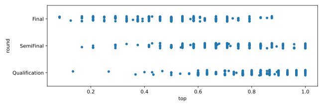
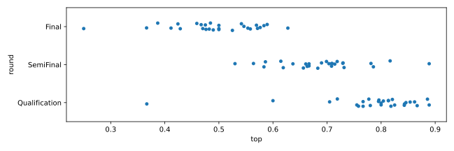
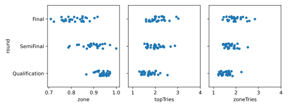
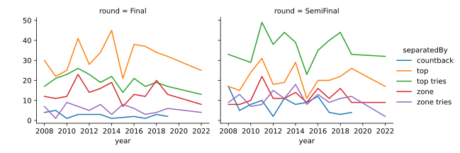
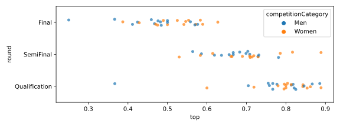
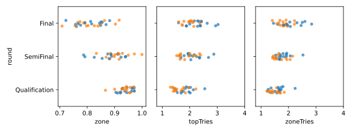

My partner and I watch a lot of competitive climbing. I think I've seen
every [IFSC] boulder competition since 2017 or so and most lead climbing
competitions since 2020. It's fun to see people who share your hobbies
but are a million times better at them than you could ever realistically
hope to be! Mostly fun at least.

One thing we've noticed, or think we've noticed, is that, across the
men's and women's rounds, the boulder problems for the women climbers
look easier for them than the men's problems look for the men. [Matt Groom]
has also pointed out in broadcasts moves that the route setters assure
him are impossible, rests that route setters have assured him don't exist,
and heel hooks that route setters have told him are supposed to be worthless.
I think this happens most often on women's climbs.
Janja Garnbret (the presumptive competitive climbing GOAT) has
[called for harder routesetting] for the women on several occasions,
and Staja Gejo [attributed a bad finals outcome] in Chamonix this year
to all of the IFSC's routtesetters' being men.

[Chamonix 2022] was a rare mess -- four women topped the final wall,
so a performance that's normally good for first or second, for one of
the competitors, wasn't even enough to make the podium. 

But how often do the route setters miss that badly? Do they disproportionately
set easier rounds for the women's category? Have there been recent changes
to relative difficulty? I wanted to know how well routesetters have done
working towards what I think their goals are
and whether there were differences in how successful they are setting boulders
for men and women.

## The rules

### IFSC scorekeeping

If you already watch a lot of IFSC competitions, you can skip this section. It exists to introduce
IFSC scoring to someone who ends up on this blog post without a deep climbing background.

The winner of an IFSC bouldering contest is determined, in order, by:

1. how many boulder problems each competitor reaches the top of ("tops," for short)
2. how many boulder problems each competitor reaches a specially marked "zone" hold of ("zones," for short)
3. how many attempts it took them in total for boulders they reached the top of ("topped")
4. how many attempts it took them in total to reach the zone for boulders they reached the zone hold of ("zoned")

tl;dr for scorekeeping in general: there rae two special holds per climb, you get points for reaching each of them,
and it's better to reach things in fewer attempts than more attempts.

If two climbers finish tied across the values above, then the ranking is determined by "count-back", which means
use the ranking from the previous round. If two climbers are tied in the previous round as well, e.g. in a final
where the two climbers also tied in the semi-final, then the ranking is determined by count-back all the way back
to the qualification round.[^1]

### Pre-registration

With those rules in mind, there are a few things that commentators talk about the route setters trying to accomplish.
We can use those goals to come up with some definitions for more and less successful boulder rounds.

1. Boulders should _separate_ the climbers. Most specifically, this means "count-back is a bad outcome." More generally,
   it means that it's best if rankings are determined by tops, next best if they're determined by number of zones, next
   best if they're determined by attempts, and worst if they're determined by count-back.
2. The boulders shouldn't be impossible. The field of climbers should be able to make progress in the four minutes
   that climbers get for each boulder. There should be few boulders that no one tops, and fewer still boulders where no
   one achieves the zone.
3. The boulders shouldn't be "too easy." It's hard to say what "too easy" means in general, but it's easy to illustrate
   in extremes. A boulder that everyone in the field tops on their first try ("flashes") is too easy. A boulder that half
   of the field flashes is probably also too easy. A boulder that one or two people flash is probably ok.
4. Rounds should get progressively harder. In broad strokes this means top scores should be lower in semi-finals than
  qualification and lower in finals than semi-finals. Also, given that a boulder was topped or zoned, it should take
  more attempts to get the top or zone in later rounds than earlier rounds.

So in the interest of statistical integrity, here are the questions I'd like to answer about men's and women's boulder
rounds and whether the women regularly get different sorts of rounds from the men:

1. Do the rounds tend to get harder? I don't normally watch qualification and only sometimes watch semis.
  Six climbers make finals, so there are six climbers who have data for all three rounds. For those six climbers,
  if the rounds get harder, the overall top percentage should decrease, the overall zone percentage should decrease,
  attempts per top should increase, and attempts per zone should increase over the three rounds.[^2]
2. How often is making a semi-final or final determined by attempts? How often is making a semi-final or final
  determined by exactly one attempt? How often is count-back necessary, and for what ranks?[^3]
3. Do the answers to the previous two questions vary for the men's and women's events?

The point of choosing my questions in advance is that I don't know the answers to any of these questions right now,
so the questions can't be cherry-picked to make a point. I'll know soon though! Let's begin.

## Analysis

I downloaded IFSC results for every season from 2008 to 2022 (except 2021, which was mostly cancelled). I wrote a little [CLI program] to I download
individual seasons. For each season, I have a CSV with:

- `year`
- `eventName`
- `competitorName`
- `rank`
- `round`
- `top`
- `topTries`
- `zone`
- `zoneTries`
- `competitionCategory`

Scripts for analyzing the questions above can be found in that program's [analysis directory][^4].

### Route-setting goals: progression and difficulty

As a first check, it's worth seeing whether rounds tend to get harder. There are a few ways to do this. The most obvious way
is to check on top percentages. Intuitively, if a round has harder boulders, fewer climbers will reach the top of each boulder.
But we can't _just_ look at top percentages in each round -- the climbers attempting the boulders in the qualification round
are a different population from the climbers attempting the boulders in the final round, so it's incorrect to compare the
results directly. Instead, we can filter to only those climbers who climbed in all three rounds and see how frequently they
reached the tops of boulders. Looking at each year, rounds seem to get progressively harder.

This plot shows, for each boulder event since 2008, the percentage of boulders that were topped in the final, semifinal, and
qualification rounds:

If you squint a little, you can sort of see that finals are on average a bit harder than semis,
and semis are a bit harder than qualification rounds.

The trend is a more obvious if you look at the top percentage in each round by year, instead of
for individual events:

There are other ways to measure difficulty. Instead of just focusing on tops,
we could look at the zone percentage, which should also decrease between
rounds if boulders are getting harder. Or we could look at attempts for each
successful top or zone, which should _increase_ across rounds if the boulders
are getting harder. I checked those as well.

On the left is zone percentage, which, like the top percentage, moves left as the rounds
advance. In the middle and on the right are attempts to reach each scoring opportunity,
which moves right a bit as the rounds advance.

These measures tell the same story as the top percentage. Overall, the
routesetters do a pretty good job of setting progressively more difficult rounds.

Additionally, the general difficulty of the boulders looks pretty well calibrated! If all I told
you before you saw someone try a boulder was which round it was from and that the climber who would
attempt it made the finals, you might guess that it's about a coin flip whether they'd top it if it's a
finals boulder, a little better than a coin flip if it's a semis boulder, and pretty likely they'd top it
if it's a qualification boulder. The distributions for each round look challenging but not impossible.
There are outliers, but mostly, the top percentages are in a range I'd consider "reasonable."[^5]

### Route-setting goals: separation

The other goal to check on is separation. There's no such thing as "good" or "bad" separation in general,
just better and worse. The importance of separation also isn't constant over the course of a competition. If the difference
between ranks 38 and 39 is one attempt to the zone hold, that's not a big deal, since neither of those climbers is
all that close to making the semi-final. If the difference between first and second in the final is one
attempt to zone in the _semifinal_, that's really bad! For each rank, I calculated how often each type of separation splits it from 
the next rank.

Over all of the finals in the dataset, that ends up looking like this:

<table id="T_ec99c">
  <thead>
    <tr>
      <th class="index_name level0" >separatedBy</th>
      <th id="T_ec99c_level0_col0" class="col_heading level0 col0" >top</th>
      <th id="T_ec99c_level0_col1" class="col_heading level0 col1" >zone</th>
      <th id="T_ec99c_level0_col2" class="col_heading level0 col2" >top tries</th>
      <th id="T_ec99c_level0_col3" class="col_heading level0 col3" >zone tries</th>
      <th id="T_ec99c_level0_col4" class="col_heading level0 col4" >countback</th>
    </tr>
    <tr>
      <th class="index_name level0" >withinRoundRank</th>
      <th class="blank col0" >&nbsp;</th>
      <th class="blank col1" >&nbsp;</th>
      <th class="blank col2" >&nbsp;</th>
      <th class="blank col3" >&nbsp;</th>
      <th class="blank col4" >&nbsp;</th>
    </tr>
  </thead>
  <tbody>
    <tr>
      <th id="T_ec99c_level0_row0" class="row_heading level0 row0" >1</th>
      <td id="T_ec99c_row0_col0" class="data row0 col0" >90</td>
      <td id="T_ec99c_row0_col1" class="data row0 col1" >14</td>
      <td id="T_ec99c_row0_col2" class="data row0 col2" >70</td>
      <td id="T_ec99c_row0_col3" class="data row0 col3" >11</td>
      <td id="T_ec99c_row0_col4" class="data row0 col4" >5</td>
    </tr>
    <tr>
      <th id="T_ec99c_level0_row1" class="row_heading level0 row1" >2</th>
      <td id="T_ec99c_row1_col0" class="data row1 col0" >85</td>
      <td id="T_ec99c_row1_col1" class="data row1 col1" >27</td>
      <td id="T_ec99c_row1_col2" class="data row1 col2" >59</td>
      <td id="T_ec99c_row1_col3" class="data row1 col3" >12</td>
      <td id="T_ec99c_row1_col4" class="data row1 col4" >7</td>
    </tr>
    <tr>
      <th id="T_ec99c_level0_row2" class="row_heading level0 row2" >3</th>
      <td id="T_ec99c_row2_col0" class="data row2 col0" >78</td>
      <td id="T_ec99c_row2_col1" class="data row2 col1" >33</td>
      <td id="T_ec99c_row2_col2" class="data row2 col2" >57</td>
      <td id="T_ec99c_row2_col3" class="data row2 col3" >15</td>
      <td id="T_ec99c_row2_col4" class="data row2 col4" >7</td>
    </tr>
    <tr>
      <th id="T_ec99c_level0_row3" class="row_heading level0 row3" >4</th>
      <td id="T_ec99c_row3_col0" class="data row3 col0" >79</td>
      <td id="T_ec99c_row3_col1" class="data row3 col1" >44</td>
      <td id="T_ec99c_row3_col2" class="data row3 col2" >43</td>
      <td id="T_ec99c_row3_col3" class="data row3 col3" >22</td>
      <td id="T_ec99c_row3_col4" class="data row3 col4" >2</td>
    </tr>
    <tr>
      <th id="T_ec99c_level0_row4" class="row_heading level0 row4" >5</th>
      <td id="T_ec99c_row4_col0" class="data row4 col0" >84</td>
      <td id="T_ec99c_row4_col1" class="data row4 col1" >65</td>
      <td id="T_ec99c_row4_col2" class="data row4 col2" >25</td>
      <td id="T_ec99c_row4_col3" class="data row4 col3" >12</td>
      <td id="T_ec99c_row4_col4" class="data row4 col4" >4</td>
    </tr>
  </tbody>
</table>

Each cell shows how often each rank is decided by a kind of separation. The first row is for rank 1.
Going across, it shows that, at 90 events, the winner won because they had more tops than the second place
climber, at 14 events, they won because they had more zones than the second place climber despite being tied
on tops, at 70 events they won because they had fewer attempts to top than the second place climber while
tied on tops and zones, etc. The cells are also colored for their relative frequencies, with darker greens
showing a higher relative frequency.

And overall this looks... pretty successful? I'm not 100% sure what I thought I'd see here, but the most
valuable places are all decided by tops a plurality of the time, top tries separate much more often than
zone tries, count-back is really rare... this looks pretty good!

Semis looks mostly similar:

<table id="T_122a2">
  <thead>
    <tr>
      <th class="index_name level0" >separatedBy</th>
      <th id="T_122a2_level0_col0" class="col_heading level0 col0" >top</th>
      <th id="T_122a2_level0_col1" class="col_heading level0 col1" >zone</th>
      <th id="T_122a2_level0_col2" class="col_heading level0 col2" >top tries</th>
      <th id="T_122a2_level0_col3" class="col_heading level0 col3" >zone tries</th>
      <th id="T_122a2_level0_col4" class="col_heading level0 col4" >countback</th>
    </tr>
    <tr>
      <th class="index_name level0" >withinRoundRank</th>
      <th class="blank col0" >&nbsp;</th>
      <th class="blank col1" >&nbsp;</th>
      <th class="blank col2" >&nbsp;</th>
      <th class="blank col3" >&nbsp;</th>
      <th class="blank col4" >&nbsp;</th>
    </tr>
  </thead>
  <tbody>
    <tr>
      <th id="T_122a2_level0_row0" class="row_heading level0 row0" >1</th>
      <td id="T_122a2_row0_col0" class="data row0 col0" >69</td>
      <td id="T_122a2_row0_col1" class="data row0 col1" >13</td>
      <td id="T_122a2_row0_col2" class="data row0 col2" >80</td>
      <td id="T_122a2_row0_col3" class="data row0 col3" >16</td>
      <td id="T_122a2_row0_col4" class="data row0 col4" >11</td>
    </tr>
    <tr>
      <th id="T_122a2_level0_row1" class="row_heading level0 row1" >2</th>
      <td id="T_122a2_row1_col0" class="data row1 col0" >54</td>
      <td id="T_122a2_row1_col1" class="data row1 col1" >21</td>
      <td id="T_122a2_row1_col2" class="data row1 col2" >72</td>
      <td id="T_122a2_row1_col3" class="data row1 col3" >21</td>
      <td id="T_122a2_row1_col4" class="data row1 col4" >21</td>
    </tr>
    <tr>
      <th id="T_122a2_level0_row2" class="row_heading level0 row2" >3</th>
      <td id="T_122a2_row2_col0" class="data row2 col0" >41</td>
      <td id="T_122a2_row2_col1" class="data row2 col1" >27</td>
      <td id="T_122a2_row2_col2" class="data row2 col2" >89</td>
      <td id="T_122a2_row2_col3" class="data row2 col3" >21</td>
      <td id="T_122a2_row2_col4" class="data row2 col4" >11</td>
    </tr>
    <tr>
      <th id="T_122a2_level0_row3" class="row_heading level0 row3" >4</th>
      <td id="T_122a2_row3_col0" class="data row3 col0" >39</td>
      <td id="T_122a2_row3_col1" class="data row3 col1" >36</td>
      <td id="T_122a2_row3_col2" class="data row3 col2" >77</td>
      <td id="T_122a2_row3_col3" class="data row3 col3" >23</td>
      <td id="T_122a2_row3_col4" class="data row3 col4" >14</td>
    </tr>
    <tr>
      <th id="T_122a2_level0_row4" class="row_heading level0 row4" >5</th>
      <td id="T_122a2_row4_col0" class="data row4 col0" >35</td>
      <td id="T_122a2_row4_col1" class="data row4 col1" >31</td>
      <td id="T_122a2_row4_col2" class="data row4 col2" >76</td>
      <td id="T_122a2_row4_col3" class="data row4 col3" >28</td>
      <td id="T_122a2_row4_col4" class="data row4 col4" >19</td>
    </tr>
    <tr>
      <th id="T_122a2_level0_row5" class="row_heading level0 row5" >6</th>
      <td id="T_122a2_row5_col0" class="data row5 col0" >34</td>
      <td id="T_122a2_row5_col1" class="data row5 col1" >28</td>
      <td id="T_122a2_row5_col2" class="data row5 col2" >82</td>
      <td id="T_122a2_row5_col3" class="data row5 col3" >28</td>
      <td id="T_122a2_row5_col4" class="data row5 col4" >17</td>
    </tr>
  </tbody>
</table>

In both semis and finals, count-back is _really rare_, zone tries are a less common separator than
top tries, and tops are a more common separator than zones.
This looks like the route setters are pretty successful at setting boulders that separate the climbers
based on how they climbed in the round.

How ranks are separated is also reasonably consistent over time.

This plot shows for the top five ranks in finals and top six ranks in semis, how often they're separated from
the next rank over all of the semis and finals within each year.
While the proportion of each type of separation varies, the order of how often each occurs stays mostly the same.

I think this all points to the route setters being consistent in how they approach separation.

### But what about differences between the men's and women's rounds?

Yeah... about that. Staja Gejo, Janja Garnbret, and others who've pointed out
rounds where the boulders or routes don't quite work for the women's field have a point.

Rounds are progressive in difficulty for both the men and women, but the level
of difficulty is noticeably different.

Here, the orange dots are top percentages in women's rounds, and the blue dots are top percentages in men's rounds.
The hardest rounds tend to be men's rounds, and the easiest rounds tend to be women's rounds.

The alternative measures of difficulty are similar, if relatively muddled:

Progression is present for both men's and women's rounds, but less pronounced for the women's rounds -- the peak of
difficulty routesetters achieve for the women's field is 
mostly lower than the peak for the men's field, and the
easiest rounds in the alternative measures also tend to be women's
rounds.

Separation is also less successful for women's rounds than men's.
For men's finals, separation is largely like the table we saw before:

<table id="T_133e7">
  <thead>
    <tr>
      <th class="index_name level0" >separatedBy</th>
      <th id="T_133e7_level0_col0" class="col_heading level0 col0" >top</th>
      <th id="T_133e7_level0_col1" class="col_heading level0 col1" >zone</th>
      <th id="T_133e7_level0_col2" class="col_heading level0 col2" >top tries</th>
      <th id="T_133e7_level0_col3" class="col_heading level0 col3" >zone tries</th>
      <th id="T_133e7_level0_col4" class="col_heading level0 col4" >countback</th>
    </tr>
    <tr>
      <th class="index_name level0" >withinRoundRank</th>
      <th class="blank col0" >&nbsp;</th>
      <th class="blank col1" >&nbsp;</th>
      <th class="blank col2" >&nbsp;</th>
      <th class="blank col3" >&nbsp;</th>
      <th class="blank col4" >&nbsp;</th>
    </tr>
  </thead>
  <tbody>
    <tr>
      <th id="T_133e7_level0_row0" class="row_heading level0 row0" >1</th>
      <td id="T_133e7_row0_col0" class="data row0 col0" >51</td>
      <td id="T_133e7_row0_col1" class="data row0 col1" >9</td>
      <td id="T_133e7_row0_col2" class="data row0 col2" >28</td>
      <td id="T_133e7_row0_col3" class="data row0 col3" >6</td>
      <td id="T_133e7_row0_col4" class="data row0 col4" >1</td>
    </tr>
    <tr>
      <th id="T_133e7_level0_row1" class="row_heading level0 row1" >2</th>
      <td id="T_133e7_row1_col0" class="data row1 col0" >37</td>
      <td id="T_133e7_row1_col1" class="data row1 col1" >17</td>
      <td id="T_133e7_row1_col2" class="data row1 col2" >32</td>
      <td id="T_133e7_row1_col3" class="data row1 col3" >7</td>
      <td id="T_133e7_row1_col4" class="data row1 col4" >2</td>
    </tr>
    <tr>
      <th id="T_133e7_level0_row2" class="row_heading level0 row2" >3</th>
      <td id="T_133e7_row2_col0" class="data row2 col0" >35</td>
      <td id="T_133e7_row2_col1" class="data row2 col1" >16</td>
      <td id="T_133e7_row2_col2" class="data row2 col2" >32</td>
      <td id="T_133e7_row2_col3" class="data row2 col3" >7</td>
      <td id="T_133e7_row2_col4" class="data row2 col4" >5</td>
    </tr>
    <tr>
      <th id="T_133e7_level0_row3" class="row_heading level0 row3" >4</th>
      <td id="T_133e7_row3_col0" class="data row3 col0" >38</td>
      <td id="T_133e7_row3_col1" class="data row3 col1" >20</td>
      <td id="T_133e7_row3_col2" class="data row3 col2" >22</td>
      <td id="T_133e7_row3_col3" class="data row3 col3" >14</td>
      <td id="T_133e7_row3_col4" class="data row3 col4" >1</td>
    </tr>
    <tr>
      <th id="T_133e7_level0_row4" class="row_heading level0 row4" >5</th>
      <td id="T_133e7_row4_col0" class="data row4 col0" >31</td>
      <td id="T_133e7_row4_col1" class="data row4 col1" >38</td>
      <td id="T_133e7_row4_col2" class="data row4 col2" >15</td>
      <td id="T_133e7_row4_col3" class="data row4 col3" >7</td>
      <td id="T_133e7_row4_col4" class="data row4 col4" >4</td>
    </tr>
  </tbody>
</table>

Tops are the most common separation, and they separate the winner from second
place about half the time.

That's not the case on the women's side:

<table id="T_220dd">
  <thead>
    <tr>
      <th class="index_name level0" >separatedBy</th>
      <th id="T_220dd_level0_col0" class="col_heading level0 col0" >top</th>
      <th id="T_220dd_level0_col1" class="col_heading level0 col1" >zone</th>
      <th id="T_220dd_level0_col2" class="col_heading level0 col2" >top tries</th>
      <th id="T_220dd_level0_col3" class="col_heading level0 col3" >zone tries</th>
      <th id="T_220dd_level0_col4" class="col_heading level0 col4" >countback</th>
    </tr>
    <tr>
      <th class="index_name level0" >withinRoundRank</th>
      <th class="blank col0" >&nbsp;</th>
      <th class="blank col1" >&nbsp;</th>
      <th class="blank col2" >&nbsp;</th>
      <th class="blank col3" >&nbsp;</th>
      <th class="blank col4" >&nbsp;</th>
    </tr>
  </thead>
  <tbody>
    <tr>
      <th id="T_220dd_level0_row0" class="row_heading level0 row0" >1</th>
      <td id="T_220dd_row0_col0" class="data row0 col0" >39</td>
      <td id="T_220dd_row0_col1" class="data row0 col1" >5</td>
      <td id="T_220dd_row0_col2" class="data row0 col2" >42</td>
      <td id="T_220dd_row0_col3" class="data row0 col3" >5</td>
      <td id="T_220dd_row0_col4" class="data row0 col4" >4</td>
    </tr>
    <tr>
      <th id="T_220dd_level0_row1" class="row_heading level0 row1" >2</th>
      <td id="T_220dd_row1_col0" class="data row1 col0" >48</td>
      <td id="T_220dd_row1_col1" class="data row1 col1" >10</td>
      <td id="T_220dd_row1_col2" class="data row1 col2" >27</td>
      <td id="T_220dd_row1_col3" class="data row1 col3" >5</td>
      <td id="T_220dd_row1_col4" class="data row1 col4" >5</td>
    </tr>
    <tr>
      <th id="T_220dd_level0_row2" class="row_heading level0 row2" >3</th>
      <td id="T_220dd_row2_col0" class="data row2 col0" >43</td>
      <td id="T_220dd_row2_col1" class="data row2 col1" >17</td>
      <td id="T_220dd_row2_col2" class="data row2 col2" >25</td>
      <td id="T_220dd_row2_col3" class="data row2 col3" >8</td>
      <td id="T_220dd_row2_col4" class="data row2 col4" >2</td>
    </tr>
    <tr>
      <th id="T_220dd_level0_row3" class="row_heading level0 row3" >4</th>
      <td id="T_220dd_row3_col0" class="data row3 col0" >41</td>
      <td id="T_220dd_row3_col1" class="data row3 col1" >24</td>
      <td id="T_220dd_row3_col2" class="data row3 col2" >21</td>
      <td id="T_220dd_row3_col3" class="data row3 col3" >8</td>
      <td id="T_220dd_row3_col4" class="data row3 col4" >1</td>
    </tr>
    <tr>
      <th id="T_220dd_level0_row4" class="row_heading level0 row4" >5</th>
      <td id="T_220dd_row4_col0" class="data row4 col0" >53</td>
      <td id="T_220dd_row4_col1" class="data row4 col1" >27</td>
      <td id="T_220dd_row4_col2" class="data row4 col2" >10</td>
      <td id="T_220dd_row4_col3" class="data row4 col3" >5</td>
      <td id="T_220dd_row4_col4" class="data row4 col4" >0</td>
    </tr>
  </tbody>
</table>

On the women's side, the most important separation -- first vs. second --
is most commonly top tries. That's a drag! Separation on tops is at least the second
most common occurrence, but still.

Given the differences in boulder difficulty, men's and women's finals
are not the same kind of competition.
On the men's side, competitors can focus only on climbing what they can, knowing
that topping a few hard boulders is likely to be enough to win.
On the women's side, competitors have to prioritize extreme economy in their number of attempts,
expecting that the other competitors will top several of the boulders as well.

Nowhere was this difference more evident than at Meiringen 2018.
On the women's side, topping all four boulders in 9 attempts was only good for third place,
while on the men's side, three tops was enough to be alone in first.[^6]

When route setters have pushed the athletes, they've produced some incredible climbing moments.
For [Adam Ondra's hand jam], Ai Mori's high foot in Koper last year,

`video: https://www.youtube.com/watch?v=cugt-GBT9xg`

and Yoshiyuki Ogata's feet first method at Adidas Rockstars in 2019 (admittedly not an IFSC event),

`video: https://www.youtube.com/watch?v=5qIPZrwnQak`

a part of what made the climbs so spectacular is how hard they were for everyone else in the round.
For someone to stand out that way, the boulders have to be hard enough to stop most of the field.

So here's my plea to routesetters. You're weirdly good at assessing the relative difficulty of
different boulders, and I think if you wanted to you could produce women's finals with scores like the men's.
So don't hold back! Let Janja[^7] cook! She and the rest of the top of the women's field
will climb the boulders spectacularly, they'll look really cool, you'll look really cool by extension,
and everyone else will get an amazing boulder season for both the men and women.

Finals boulders have been relatively easy for the top women climbers for too long. Easier boulders and worse separation at the
top of the women's field have required the top women to climb nearly perfectly to win. With harder boulders, we could
see them climb their best.

[Ondra hand jam]: https://www.rockandice.com/climbing-news/ondra-hand-jams-his-way-to-gold-garnbret-tops-three-in-meiringen/
[attributed a bad finals outcome]: https://gripped.com/indoor-climbing/ondra-gold-overshadowed-by-contentious-separation-in-womens-final/
[called for harder routesetting]: https://www.instagram.com/div/CgCrq1gDV3F/
[Chamonix 2022]: https://www.youtube.com/watch?v=_wIP_73GTYQ 
[IFSC]: https://www.ifsc-climbing.org/
[Matt Groom]: https://www.instagram.com/mattgroom1/?hl=en
[CLI program]: https://github.com/jisantuc/ifsc-client/
[analysis directory]: https://github.com/jisantuc/ifsc-client/tree/main/analysis
[2017]: https://www.horosvaz.cz/res/archive/155/022581.pdf?seek=1490603491
[2018]: https://cdn.ifsc-climbing.org/images/World_Competitions/IFSC-Rules_2018_V15.pdf
[^1]:
  This actually happened in the Chamonix lead final mentioned above -- several of the women climbers topped both the final lead route
  and the semi-final route. It's very rare and a very bad outcome.
[^2]:
  There's likely to be some noise in the attempt data. With four minutes, climbers will have time for fewer attempts on a long, powerful boulder with the hard moves at the top than on a dynamic boulder with a low-percentage move right at the bottom. Rolling up to whole rounds mitigates that noise to an extent, because routesetters don't set whole rounds of long powerful boulders or boulders with low percentage starting moves.
[^3]:
  It's subjectively less bad if count-back is necessary to separate fifth and sixth than it is if count-back determines third and fourth or first and second.
[^4]:
  For everything in the program's repo, you'll be best off getting set up with `nix` to make sure you have identical versions to what I have.
[^5]:
  Don't ask me what the endpoints are for "reasonable." I have no idea. The Meiringen 2018 Women's final, where the finalists
  reached the top in 20 of their 24 opportunities, was too easy. The Vienna 2011 men's final and Munich 2010 women's final,
  where finalists reached the top in 2 of their 24 opportunities, were too hard. I don't know where I'd draw the line for the transition
  from "too easy" to "acceptably easy" or "too hard" to "acceptably hard."
[^6]:
  See the video at https://youtu.be/fBS0v29rACQ, with scoring at 1:40:18 and 3:26:14.
[^7]: and the rest of the _really deep_ women's field right now
