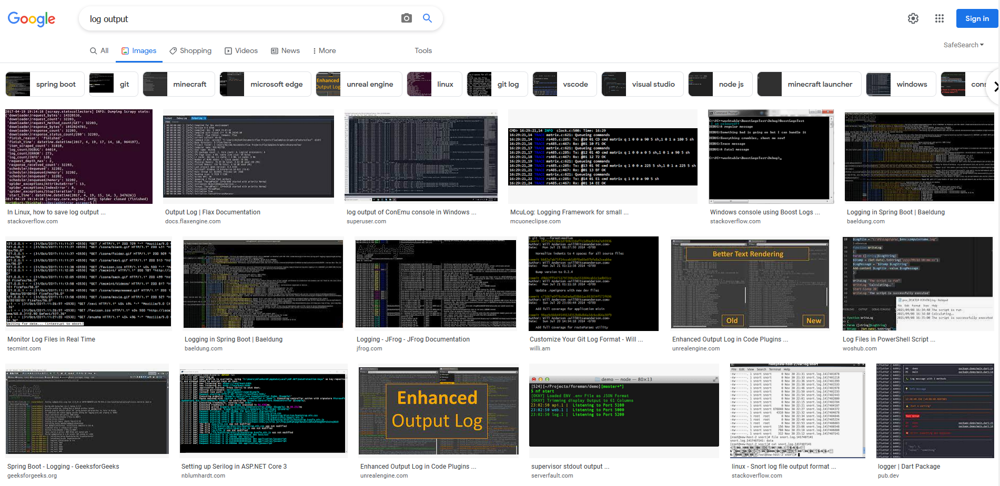

In past work projects, when I've been on a team needing a way to package a Scala application,
I've relied on [`sbt-assembly`](https://github.com/sbt/sbt-assembly). `sbt-assembly` is great
for what it's for -- it bundles up dependencies and application code in a single fat
`jar` file, and you can run it anywhere with a Java runtime (subject to all the normal caveats
about Java versions).

That's great, but more recently, support for bundling Scala apps in other ways has flourished.
[`scala-native`](https://scala-native.readthedocs.io/en/latest/#) targets generic POSIX environments,
[Scala.js](https://www.scala-js.org/) targets the browser and hit 1.0 in 2020, and GraalVM provides
an alternate Java runtime environment
["designed to accelerate the execution of applications written in [...] JVM languages."](https://www.graalvm.org/22.1/docs/getting-started/).

Each of those is developed enough
to have its own sbt plugin. Partly because I wanted the tool, and partly because I wanted to play
around with new application bundling options, I used GraalVM and Scala.js to bundle up a CLI
app for adding rainbow brackets to streaming input.

## Rainbow brackets

Rainbow brackets are great. No one has ever looked at an editor with a rainbow bracket plugin enabled and said
"you know what, too much syntactical info in the bracket colors for me." However! Not everyone has access to rainbow
brackets everywhere they could. You while Looking at Source Code probably feels an ineffable unease when looking
at monochrome source code. You while Looking at Logs and Waxing Inexplicably French is probably like
"ehhhh it's an inscrutable mass, que sera sera."



But there's another way! It turns out matching parentheses problems are not very difficult puzzles.
If you desire in your heart of hearts to have special colors for brackets, parentheses, and braces that
happen to complete each other... you don't need to suffer in vain, or something.

## The code

Algorithmically, the CLI is _really simple_. For some streaming input, if you see a character that opens a
pair like `[`, `(`, or `{`, rewrite it to a special colorized version of that same character and push to a stack.
If you see a character that closes a pair like `]`, `)`, or `}`, rewrite it to a special colorized version of that
same character and pop off a stack.

We have a few fancy options here. I was inspired by Michael Pilquist's [`hexdump4s`](https://github.com/scodec/hexdump4s)
and got excited about functional abstractions and _doing the right thing_™️. I wanted to model the state of the parentheses
counter using either a `Ref` or a `StateT[Stream[F, *], Color, *]`. Fancy values! It turns out I didn't need fancy values.
I enthusiastically stole the ["file path or stdin" handling from `hexdump4s`](https://github.com/scodec/hexdump4s/blob/89271648d5d3d325557562df15c32ad6609a8f2b/hexdump4s.scala#L20-L43), then tracked the state of the color wheel
using a very unsafe, privately immutable [`Ring`](https://github.com/jisantuc/rb-paren-cli/blob/v0.0.1/src/main/scala/io/github/jisantuc/rbparencli/Ring.scala)
`trait`. It tracks a collection of values with size `n` against an index modulo an internal counter.

With the `Ring` in hand, it was pretty straightforward to handle the rest. [`decline`](https://github.com/bkirwi/decline) is wonderful
for config / command line argument parsing, [`fs2`](https://github.com/typelevel/fs2) is the GOAT for constant memory IO,
and [`cats-parse`](https://github.com/typelevel/cats-parse) is simple and nice for defining shapes of custom string formats
on the fly. The `decline` + `cats-parse` combo was great for defining the shapes of my color arguments. Since CLIs have to deal with horrible string formats all the time, it was great to be able to concissely represent the rules for _good_ strings and hook that into argument parsing.
Note that once we're in application logic, everything is purely in domain types --
the function responsible for transforming input is [`colorize`](https://github.com/jisantuc/rb-paren-cli/blob/v0.0.1/src/main/scala/io/github/jisantuc/rbparencli/Main.scala#L21-L39), and it knows nothing of effects or streaming or arguments, just "if you can give me a palette
and a character, I can color that character."

The end result looks like this:


So that's the pinnacle of side project completion -- _it runs on my machine for toy inputs_.

## Bundling for linux

But there are _other_ machines [citation needed], and it's possible that someone who doesn't want to learn
how to use `sbt` might want rainbow brackets for their log output. No one has asked me for this, but it's technically
possible.

I used [`sbt-native-packager`](https://github.com/sbt/sbt-native-packager) as the packaging plugin, but instead
of following the GraalVM JVM setup guides, I fired up a `nix repl`, loaded up `nixpkgs`, crossed my fingers,
and pressed `<TAB>` a few times after typing `graal`. There was a package available (`graalvm-11-ce`) so I added it to `flake.nix`,
, and gave packaging the app up a try.

Cross-project configuration for packaging the app was embarrassingly easy:

```scala
lazy val rootJVM = root.jvm
  .settings(
    graalVMNativeImageOptions ++= Seq(
      // prevents image creation and prints more output when bundling
      // is *waves hands* incomplete
      "--no-fallback",
      // creates basically a fat jar instead of a binary that requires
      // path / classpath information to execute
      "--static",
      // provides nicer logging output when exceptions are encountered
      "-H:+ReportExceptionStackTraces"
    ),
    GraalVMNativeImage / name := "rainbow-parens"
  )
  .enablePlugins(GraalVMNativeImagePlugin)
```

The `--static` option was really important; it was the difference between being able to run the
CLI if I copied it somewhere else on my machine and not being able to run it. However, that's...
not very many options to specify. If I compare it to common `sbt-assembly` options at least,
it's [fewer lines and less cryptic](https://github.com/raster-foundry/raster-foundry/blob/1.70.1/build.sbt#L126-L136)
than what I've wound up with working on other projects.

## Bundling for MacOS

MacOS is very special and required special handling. [In principle](https://www.graalvm.org/22.1/docs/getting-started/macos/)
it should be possible to set up GraalVM packaging on MacOS, but I don't really know anything
about GraalVM or MacOS, so...


But there's another option! `Scala.js` cross-project setups are pretty well ironed out, and all of my dependencies
are cross-published for `Scala.js`, so here's all I had to do to bundle up a nice `node.js` script:

```scala
lazy val root =
  (crossProject(JSPlatform, JVMPlatform).crossType(CrossType.Pure) in file("."))
    .settings(settings: _*)
    .jsSettings(
      scalaJSUseMainModuleInitializer := true,
      scalaJSLinkerConfig ~= { _.withModuleKind(ModuleKind.CommonJSModule) },
      Compile / fullOptJS / artifactPath := baseDirectory.value / "rainbow-parens.js"
    )
```

MacOS users have a little more work to do to make sure they can use `rainbow-parens` as a CLI,
but [not much more work](https://github.com/jisantuc/rb-paren-cli#nodejs-script).

## Release and publication

Because Node.js is basically universal, I didn't have to split the release workflow. Also,
because I have a `nix` shell available, I don't have to do much in terms of dependency setup in CI --
instead I can set up `nix` and let it handle making sure I have everything I need.
The bundling step [invokes `sbt` commands in a `nix` shell](https://github.com/jisantuc/rb-paren-cli/blob/main/.github/workflows/release.yml#L18-L25)
then points a [release action](https://github.com/ncipollo/release-action) at the artifacts.
And we're done!

This experiment was also a bit inspired by @hillelogram's [mise en place](https://twitter.com/hillelogram/status/1514352882807721984) --
the application here is _really simple_, so it was fine to take a little more technical risk with the release
tooling. And it worked really well! "Always mise en place" is a good kitchen rule, and it
turns out to work well for taking risk out of future technical choices too.
