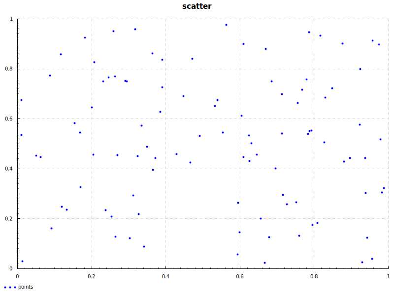

I learned Python a decade ago because I visited my partner's lab when she was working on [SPIDER] and I saw plots in
[`kst`] that told her whether one of the machines would explode.[^1] I spent all of my
formative just-enough-Python-to-be-dangerous time at my first job with [`pandas`],
[`matplotlib`], and an assortment of other Python plotting libraries. I hand-rolled
tables with shaded cells and abused the annotations and shapes APIs while trying to
convince any coworker of mine who hadn't yet lost patience for that discussion that
we should get rid of all of our Stata and SAS and R and Excel[^2] and whatever else people were
using and do everything in Python. When I want to plot something now, I've often finished
typing `fig, ax = plt.subplots()` before I've even figured out what kind of plot I want.

I'm explaining all this because a week ago I got around to posting [Don't fire Styer] with some plots showing
distributions of simulated outcomes for an annual USA vs. Europe pool event. One of the challenges I set
myself while working on that was that I wasn't allowed to use Python to produce the plots -- I had to produce them in
Haskell, the same language I used for the [simulation code].

I wound up using the built-in plotting utilities of the new-ish Haskell [`dataframe`] library, but there are
options for Haskell visualization libraries now, and I wanted to know what else is out there.

This post is the first of, I don't know, probably three or four posts on data visualization
in Haskell in early 2026.

## Plotting with Haskell Libraries

I found a few libraries, with some help from the [DataHaskell Discord].

* [`dataframe`]
* [`granite`]
* [`hvega`]
* [`chart-svg`]
* [`Chart`]

I wanted to compare them on a few points, starting with what it looks like to take
a dataframe and produce a scatter plot. I think of scatter plots as "hello, world"
for plotting things.

Each library has its own idea of what kind of data is plottable. I'm starting with
a dataframe in every case to hand-wave away some of that difference and to focus instead
on getting from some kind of data to some kind of graphic.

I'm not going to pick winners and losers, just comment on what's easy and difficult
at each stage along the way. Especially at this early stage saying one library is better than another would
be premature -- "it's easy to do something easy" and "it's easy to do something hard" are basically uncorrelated.

For each plot, I used a dataframe full of random points in columns `x` and `y`. All examples are available in my
[`goofing-off` repository].

Without any further ado, here are five scatter plots with code samples.

### `dataframe`

<div class="flex-container">
<canvas id="chart_hzaBeX7xTNur2WcmsyYYME25n6c2KQCOktXeMeNeJUHJcBtiK4V" style="width:100%;max-width:600px;height:400px">
</canvas>
</div>
<script src="https://cdnjs.cloudflare.com/ajax/libs/Chart.js/2.9.4/Chart.min.js"></script>
<script>
setTimeout(function() { new Chart("chart_hzaBeX7xTNur2WcmsyYYME25n6c2KQCOktXeMeNeJUHJcBtiK4V", {
  type: "scatter",
  data: {
    datasets: [{
      label: "x vs y",
      data: [{x:0.7154568433761597, y:0.2947643995285034},{x:0.491304874420166, y:0.5322642922401428},{x:0.39046216011047363, y:0.7272851467132568},{x:0.9434694647789001, y:0.12430602312088013},{x:0.8172228932380676, y:0.9328417181968689},{x:0.20702052116394043, y:0.8265690803527832},{x:0.3850134611129761, y:0.6281203031539917},{x:0.5535401105880737, y:0.5451744794845581},{x:0.1682039499282837, y:0.5451968908309937},{x:0.6692216396331787, y:0.8793200850486755},{x:0.6037527322769165, y:0.6131811738014221},{x:0.2694072127342224, y:0.45403194427490234},{x:0.4481298327445984, y:0.6917848587036133},{x:0.2049022912979126, y:0.4566040635108948},{x:0.1813773512840271, y:0.9260448813438416},{x:0.26479393243789673, y:0.12887787818908691},{x:0.3715680241584778, y:0.44309645891189575},{x:0.3340485095977783, y:0.5733484029769897},{x:0.8970423936843872, y:0.4423656463623047},{x:0.9248749613761902, y:0.799735963344574},{x:0.29067856073379517, y:0.7520999312400818},{x:0.4665948748588562, y:0.4246252775192261},{x:0.3168206214904785, y:0.9586162567138672},{x:0.7518224716186523, y:0.26552271842956543},{x:0.17043155431747437, y:0.32658445835113525},{x:0.8799563050270081, y:0.4293408989906311},{x:1.0763108730316162e-2, y:0.5360943078994751},{x:0.13262945413589478, y:0.2368205189704895},{x:0.6786950826644897, y:0.12624341249465942},{x:0.9225376844406128, y:0.5763774514198303},{x:0.47169607877731323, y:0.839814305305481},{x:0.2624734044075012, y:0.7697386741638184},{x:0.8762596845626831, y:0.9023789763450623},{x:0.6304690837860107, y:0.5018215179443359},{x:0.3649451732635498, y:0.3958517909049988},{x:6.200563907623291e-2, y:0.44633060693740845},{x:0.3634125590324402, y:0.8629829287528992},{x:0.6564078330993652, y:0.20159292221069336},{x:0.6452106237411499, y:0.4567576050758362},{x:0.5387166738510132, y:0.6759752035140991},{x:0.532685399055481, y:0.6515228748321533},{x:0.6092560291290283, y:0.44654786586761475},{x:8.704525232315063e-2, y:0.7733371257781982},{x:0.11918103694915771, y:0.24813568592071533},{x:0.8483495116233826, y:0.7220287322998047},{x:0.5636414885520935, y:0.9771313667297363},{x:0.5938405990600586, y:5.736666917800903e-2},{x:0.4284490942955017, y:0.4581664800643921},{x:0.7956738471984863, y:0.1744115948677063},{x:0.7877580523490906, y:0.5518807172775269},{x:0.11689919233322144, y:0.8581956028938293},{x:0.5955301523208618, y:0.2642606496810913},{x:0.30282020568847656, y:0.12223702669143677},{x:0.9376263618469238, y:0.4432526230812073},{x:0.31215065717697144, y:0.292500376701355},{x:0.7132084369659424, y:0.5403861999511719},{x:0.9299296140670776, y:2.5322318077087402e-2},{x:0.7790226936340332, y:0.7585500478744507},{x:0.9573233723640442, y:0.9132817983627319},{x:0.7559014558792114, y:0.6641440987586975},{x:0.9821486473083496, y:0.3047688603401184},{x:0.6846839189529419, y:0.7502037882804871},{x:1.3933777809143066e-2, y:2.9658794403076172e-2},{x:0.3271389603614807, y:0.21826499700546265},{x:9.098237752914429e-2, y:0.161126971244812},{x:0.15455347299575806, y:0.5830862522125244},{x:0.6964901685714722, y:0.4018109440803528},{x:0.5990902781486511, y:0.14580100774765015},{x:0.2591779828071594, y:0.9512766599655151},{x:0.7594277858734131, y:0.13139528036117554},{x:0.786552906036377, y:0.9476364850997925},{x:0.6242892742156982, y:0.5344269871711731},{x:0.6098488569259644, y:0.900198757648468},{x:0.7674064636230469, y:0.7174808382987976},{x:0.7125195264816284, y:0.6994668245315552},{x:1.0790348052978516e-2, y:0.6751600503921509},{x:0.9392019510269165, y:0.30390048027038574},{x:0.6261240243911743, y:0.4310024380683899},{x:0.23731380701065063, y:0.23412281274795532},{x:0.3904950022697449, y:0.8372045159339905},{x:0.3495590090751648, y:0.48797523975372314},{x:0.666404664516449, y:2.3444414138793945e-2},{x:0.2454925775527954, y:0.7649614214897156},{x:0.9782105684280396, y:0.5182676315307617},{x:0.29520636796951294, y:0.7491326928138733},{x:0.34084075689315796, y:8.888441324234009e-2},{x:0.25382697582244873, y:0.2091572880744934},{x:0.32349830865859985, y:0.45176589488983154},{x:0.7839082479476929, y:0.5392591953277588},{x:0.9751087427139282, y:0.8981132507324219},{x:5.0105392932891846e-2, y:0.45351463556289673},{x:0.829752504825592, y:0.6858416795730591},{x:0.7929117679595947, y:0.5529950857162476},{x:0.988065779209137, y:0.3235666751861572},{x:0.9555134773254395, y:3.969937562942505e-2},{x:0.8089779615402222, y:0.1831265091896057},{x:0.8267775177955627, y:0.5052176713943481},{x:0.7265839576721191, y:0.25725698471069336},{x:0.20082682371139526, y:0.6450247168540955},{x:0.2309853434562683, y:0.7500080466270447}],
      pointRadius: 4,
      pointBackgroundColor: "rgb(75, 192, 192)"
    }]
  },
  options: {
    title: { display: true, text: "x vs y" },
    scales: {
      xAxes: [{ scaleLabel: { display: true, labelString: "x" } }],
      yAxes: [{ scaleLabel: { display: true, labelString: "y" } }]
    }
  }
})}, 100);
</script>

```haskell
{-# LANGUAGE OverloadedStrings #-}

import qualified Data.Text.IO as Text
import qualified DataFrame as D
import qualified DataFrame.Display.Web.Plot as DfPlot

dataframeScatter :: D.DataFrame -> IO ()
dataframeScatter df =
  DfPlot.plotScatter "x" "y" df
    >>= (\(DfPlot.HtmlPlot plot) -> Text.writeFile "plots/dataframeScatter.html" plot)
```

`dataframe`'s built-in plotting is what I used for the previous post. Not surprisingly, its
`plotFoo` functions all take dataframes and column references. I started on this before the new
[typed module] that can make column references type safe, so my references are just text.

The output is an `HtmlPlot` newtype around `Text`, so it's easy to send it to a file, but complicated to transform
(more to come on that in part 2).

### `granite`

<div class="flex-container">
<svg xmlns="http://www.w3.org/2000/svg" viewBox="0 0 790 396" width="790" height="396" font-family="system-ui, -apple-system, sans-serif">
<rect width="100%" height="100%" fill="white"/>
<text x="370" y="26" text-anchor="middle" fill="#222" font-size="14">points</text>
<line x1="70" y1="354" x2="670" y2="354" stroke="#aaa" stroke-width="1"/>
<line x1="70" y1="34" x2="70" y2="354" stroke="#aaa" stroke-width="1"/>
<line x1="70" y1="34" x2="66" y2="34" stroke="#aaa" stroke-width="1"/>
<text x="62" y="38" text-anchor="end" fill="#555" font-size="11">1.0</text>
<line x1="70" y1="34" x2="670" y2="34" stroke="#eee" stroke-width="0.50"/>
<line x1="70" y1="194.50" x2="66" y2="194.50" stroke="#aaa" stroke-width="1"/>
<text x="62" y="198.50" text-anchor="end" fill="#555" font-size="11">0.5</text>
<line x1="70" y1="194.50" x2="670" y2="194.50" stroke="#eee" stroke-width="0.50"/>
<line x1="70" y1="354" x2="66" y2="354" stroke="#aaa" stroke-width="1"/>
<text x="62" y="358" text-anchor="end" fill="#555" font-size="11">-0.0</text>
<line x1="70" y1="354" x2="670" y2="354" stroke="#eee" stroke-width="0.50"/>
<line x1="70" y1="354" x2="70" y2="358" stroke="#aaa" stroke-width="1"/>
<text x="70" y="370" text-anchor="middle" fill="#555" font-size="11">-0.0</text>
<line x1="70" y1="34" x2="70" y2="354" stroke="#eee" stroke-width="0.50"/>
<line x1="370.50" y1="354" x2="370.50" y2="358" stroke="#aaa" stroke-width="1"/>
<text x="370.50" y="370" text-anchor="middle" fill="#555" font-size="11">0.5</text>
<line x1="370.50" y1="34" x2="370.50" y2="354" stroke="#eee" stroke-width="0.50"/>
<line x1="670" y1="354" x2="670" y2="358" stroke="#aaa" stroke-width="1"/>
<text x="670" y="370" text-anchor="middle" fill="#555" font-size="11">1.0</text>
<line x1="670" y1="34" x2="670" y2="354" stroke="#eee" stroke-width="0.50"/>
<circle cx="490.58" cy="256.69" r="3" fill="#3498db"/>
<circle cx="365.47" cy="184.25" r="3" fill="#3498db"/>
<circle cx="309.19" cy="124.76" r="3" fill="#3498db"/>
<circle cx="617.84" cy="308.69" r="3" fill="#3498db"/>
<circle cx="547.38" cy="62.06" r="3" fill="#3498db"/>
<circle cx="206.81" cy="94.47" r="3" fill="#3498db"/>
<circle cx="306.15" cy="155.01" r="3" fill="#3498db"/>
<circle cx="400.21" cy="180.31" r="3" fill="#3498db"/>
<circle cx="185.14" cy="180.30" r="3" fill="#3498db"/>
<circle cx="464.77" cy="78.38" r="3" fill="#3498db"/>
<circle cx="428.23" cy="159.56" r="3" fill="#3498db"/>
<circle cx="241.63" cy="208.11" r="3" fill="#3498db"/>
<circle cx="341.38" cy="135.59" r="3" fill="#3498db"/>
<circle cx="205.63" cy="207.33" r="3" fill="#3498db"/>
<circle cx="192.50" cy="64.13" r="3" fill="#3498db"/>
<circle cx="239.05" cy="307.29" r="3" fill="#3498db"/>
<circle cx="298.65" cy="211.45" r="3" fill="#3498db"/>
<circle cx="277.71" cy="171.71" r="3" fill="#3498db"/>
<circle cx="591.93" cy="211.67" r="3" fill="#3498db"/>
<circle cx="607.46" cy="102.66" r="3" fill="#3498db"/>
<circle cx="253.50" cy="117.19" r="3" fill="#3498db"/>
<circle cx="351.68" cy="217.08" r="3" fill="#3498db"/>
<circle cx="268.09" cy="54.19" r="3" fill="#3498db"/>
<circle cx="510.87" cy="265.61" r="3" fill="#3498db"/>
<circle cx="186.39" cy="246.99" r="3" fill="#3498db"/>
<circle cx="582.39" cy="215.64" r="3" fill="#3498db"/>
<circle cx="97.27" cy="183.08" r="3" fill="#3498db"/>
<circle cx="165.29" cy="274.37" r="3" fill="#3498db"/>
<circle cx="470.06" cy="308.10" r="3" fill="#3498db"/>
<circle cx="606.15" cy="170.79" r="3" fill="#3498db"/>
<circle cx="354.53" cy="90.43" r="3" fill="#3498db"/>
<circle cx="237.76" cy="111.81" r="3" fill="#3498db"/>
<circle cx="580.33" cy="71.35" r="3" fill="#3498db"/>
<circle cx="443.14" cy="193.53" r="3" fill="#3498db"/>
<circle cx="294.95" cy="225.86" r="3" fill="#3498db"/>
<circle cx="125.87" cy="210.46" r="3" fill="#3498db"/>
<circle cx="294.09" cy="83.36" r="3" fill="#3498db"/>
<circle cx="457.62" cy="285.11" r="3" fill="#3498db"/>
<circle cx="451.37" cy="207.28" r="3" fill="#3498db"/>
<circle cx="391.94" cy="140.41" r="3" fill="#3498db"/>
<circle cx="388.57" cy="147.87" r="3" fill="#3498db"/>
<circle cx="431.31" cy="210.39" r="3" fill="#3498db"/>
<circle cx="139.85" cy="110.71" r="3" fill="#3498db"/>
<circle cx="157.78" cy="270.92" r="3" fill="#3498db"/>
<circle cx="564.75" cy="126.36" r="3" fill="#3498db"/>
<circle cx="405.85" cy="48.55" r="3" fill="#3498db"/>
<circle cx="422.70" cy="329.11" r="3" fill="#3498db"/>
<circle cx="330.39" cy="206.85" r="3" fill="#3498db"/>
<circle cx="535.35" cy="293.40" r="3" fill="#3498db"/>
<circle cx="530.93" cy="178.26" r="3" fill="#3498db"/>
<circle cx="156.51" cy="84.83" r="3" fill="#3498db"/>
<circle cx="423.64" cy="266.00" r="3" fill="#3498db"/>
<circle cx="260.28" cy="309.32" r="3" fill="#3498db"/>
<circle cx="614.58" cy="211.40" r="3" fill="#3498db"/>
<circle cx="265.48" cy="257.38" r="3" fill="#3498db"/>
<circle cx="489.32" cy="181.77" r="3" fill="#3498db"/>
<circle cx="610.28" cy="338.88" r="3" fill="#3498db"/>
<circle cx="526.06" cy="115.22" r="3" fill="#3498db"/>
<circle cx="625.57" cy="68.02" r="3" fill="#3498db"/>
<circle cx="513.15" cy="144.02" r="3" fill="#3498db"/>
<circle cx="639.42" cy="253.64" r="3" fill="#3498db"/>
<circle cx="473.40" cy="117.77" r="3" fill="#3498db"/>
<circle cx="99.04" cy="337.56" r="3" fill="#3498db"/>
<circle cx="273.85" cy="280.03" r="3" fill="#3498db"/>
<circle cx="142.04" cy="297.46" r="3" fill="#3498db"/>
<circle cx="177.53" cy="168.74" r="3" fill="#3498db"/>
<circle cx="479.99" cy="224.04" r="3" fill="#3498db"/>
<circle cx="425.63" cy="302.13" r="3" fill="#3498db"/>
<circle cx="235.92" cy="56.43" r="3" fill="#3498db"/>
<circle cx="515.12" cy="306.53" r="3" fill="#3498db"/>
<circle cx="530.26" cy="57.54" r="3" fill="#3498db"/>
<circle cx="439.70" cy="183.59" r="3" fill="#3498db"/>
<circle cx="431.64" cy="72.01" r="3" fill="#3498db"/>
<circle cx="519.57" cy="127.75" r="3" fill="#3498db"/>
<circle cx="488.94" cy="133.24" r="3" fill="#3498db"/>
<circle cx="97.29" cy="140.66" r="3" fill="#3498db"/>
<circle cx="615.46" cy="253.91" r="3" fill="#3498db"/>
<circle cx="440.72" cy="215.13" r="3" fill="#3498db"/>
<circle cx="223.72" cy="275.19" r="3" fill="#3498db"/>
<circle cx="309.21" cy="91.23" r="3" fill="#3498db"/>
<circle cx="286.36" cy="197.76" r="3" fill="#3498db"/>
<circle cx="463.20" cy="339.45" r="3" fill="#3498db"/>
<circle cx="228.28" cy="113.26" r="3" fill="#3498db"/>
<circle cx="637.23" cy="188.52" r="3" fill="#3498db"/>
<circle cx="256.03" cy="118.09" r="3" fill="#3498db"/>
<circle cx="281.50" cy="319.49" r="3" fill="#3498db"/>
<circle cx="232.93" cy="282.81" r="3" fill="#3498db"/>
<circle cx="271.82" cy="208.80" r="3" fill="#3498db"/>
<circle cx="528.78" cy="182.11" r="3" fill="#3498db"/>
<circle cx="635.50" cy="72.65" r="3" fill="#3498db"/>
<circle cx="119.23" cy="208.27" r="3" fill="#3498db"/>
<circle cx="554.37" cy="137.40" r="3" fill="#3498db"/>
<circle cx="533.81" cy="177.92" r="3" fill="#3498db"/>
<circle cx="642.73" cy="247.91" r="3" fill="#3498db"/>
<circle cx="624.56" cy="334.50" r="3" fill="#3498db"/>
<circle cx="542.77" cy="290.75" r="3" fill="#3498db"/>
<circle cx="552.71" cy="192.50" r="3" fill="#3498db"/>
<circle cx="496.79" cy="268.13" r="3" fill="#3498db"/>
<circle cx="203.35" cy="149.85" r="3" fill="#3498db"/>
<circle cx="220.18" cy="117.83" r="3" fill="#3498db"/>
<rect x="685" y="39" width="12" height="12" fill="#3498db"/>
<text x="701" y="49" text-anchor="start" fill="#555" font-size="11">points</text>
</svg>
</div>

```haskell
{-# LANGUAGE OverloadedStrings #-}

import qualified Data.Text.IO as Text
import qualified DataFrame as D
import qualified Granite as G
import qualified Granite.Svg as GSvg

graniteSvgScatter :: D.DataFrame -> IO ()
graniteSvgScatter df =
  let xs = D.extractNumericColumn "x" df
      ys = D.extractNumericColumn "y" df
      plot = GSvg.scatter [G.series "points" (zip xs ys)] G.defPlot
   in Text.writeFile "plots/graniteSvgScatter.html" plot
```

`granite` is another library from [`@mchav`], who also owned the `dataframe` repo before it moved to `DataHaskell`.
It originally focused on terminal plots[^3], but he added an SVG backend when I mentioned I was working on this in
the [DataHaskell Discord].

`granite` doesn't natively speak dataframes, but it's easy to get data out in the form that `granite` wants it,
specifically a `series` of point tuples. While the specifics vary, this is a common theme for the rest of the plotting
libraries, so I won't mention it again.

### `hvega`

<div class="flex-container">
<script src="https://cdn.jsdelivr.net/npm/vega@5"></script>
<script src="https://cdn.jsdelivr.net/npm/vega-lite@4"></script>
<script src="https://cdn.jsdelivr.net/npm/vega-embed"></script>
<div id="vis"></div>
</div>
<script type="text/javascript">
  var spec = {"$schema":"https://vega.github.io/schema/vega-lite/v4.json","data":{"values":[{"x":0.7154568433761597,"y":0.2947643995285034},{"x":0.491304874420166,"y":0.5322642922401428},{"x":0.39046216011047363,"y":0.7272851467132568},{"x":0.9434694647789001,"y":0.12430602312088013},{"x":0.8172228932380676,"y":0.9328417181968689},{"x":0.20702052116394043,"y":0.8265690803527832},{"x":0.3850134611129761,"y":0.6281203031539917},{"x":0.5535401105880737,"y":0.5451744794845581},{"x":0.1682039499282837,"y":0.5451968908309937},{"x":0.6692216396331787,"y":0.8793200850486755},{"x":0.6037527322769165,"y":0.6131811738014221},{"x":0.2694072127342224,"y":0.45403194427490234},{"x":0.4481298327445984,"y":0.6917848587036133},{"x":0.2049022912979126,"y":0.4566040635108948},{"x":0.1813773512840271,"y":0.9260448813438416},{"x":0.26479393243789673,"y":0.12887787818908691},{"x":0.3715680241584778,"y":0.44309645891189575},{"x":0.3340485095977783,"y":0.5733484029769897},{"x":0.8970423936843872,"y":0.4423656463623047},{"x":0.9248749613761902,"y":0.799735963344574},{"x":0.29067856073379517,"y":0.7520999312400818},{"x":0.4665948748588562,"y":0.4246252775192261},{"x":0.3168206214904785,"y":0.9586162567138672},{"x":0.7518224716186523,"y":0.26552271842956543},{"x":0.17043155431747437,"y":0.32658445835113525},{"x":0.8799563050270081,"y":0.4293408989906311},{"x":1.0763108730316162e-2,"y":0.5360943078994751},{"x":0.13262945413589478,"y":0.2368205189704895},{"x":0.6786950826644897,"y":0.12624341249465942},{"x":0.9225376844406128,"y":0.5763774514198303},{"x":0.47169607877731323,"y":0.839814305305481},{"x":0.2624734044075012,"y":0.7697386741638184},{"x":0.8762596845626831,"y":0.9023789763450623},{"x":0.6304690837860107,"y":0.5018215179443359},{"x":0.3649451732635498,"y":0.3958517909049988},{"x":6.200563907623291e-2,"y":0.44633060693740845},{"x":0.3634125590324402,"y":0.8629829287528992},{"x":0.6564078330993652,"y":0.20159292221069336},{"x":0.6452106237411499,"y":0.4567576050758362},{"x":0.5387166738510132,"y":0.6759752035140991},{"x":0.532685399055481,"y":0.6515228748321533},{"x":0.6092560291290283,"y":0.44654786586761475},{"x":8.704525232315063e-2,"y":0.7733371257781982},{"x":0.11918103694915771,"y":0.24813568592071533},{"x":0.8483495116233826,"y":0.7220287322998047},{"x":0.5636414885520935,"y":0.9771313667297363},{"x":0.5938405990600586,"y":5.736666917800903e-2},{"x":0.4284490942955017,"y":0.4581664800643921},{"x":0.7956738471984863,"y":0.1744115948677063},{"x":0.7877580523490906,"y":0.5518807172775269},{"x":0.11689919233322144,"y":0.8581956028938293},{"x":0.5955301523208618,"y":0.2642606496810913},{"x":0.30282020568847656,"y":0.12223702669143677},{"x":0.9376263618469238,"y":0.4432526230812073},{"x":0.31215065717697144,"y":0.292500376701355},{"x":0.7132084369659424,"y":0.5403861999511719},{"x":0.9299296140670776,"y":2.5322318077087402e-2},{"x":0.7790226936340332,"y":0.7585500478744507},{"x":0.9573233723640442,"y":0.9132817983627319},{"x":0.7559014558792114,"y":0.6641440987586975},{"x":0.9821486473083496,"y":0.3047688603401184},{"x":0.6846839189529419,"y":0.7502037882804871},{"x":1.3933777809143066e-2,"y":2.9658794403076172e-2},{"x":0.3271389603614807,"y":0.21826499700546265},{"x":9.098237752914429e-2,"y":0.161126971244812},{"x":0.15455347299575806,"y":0.5830862522125244},{"x":0.6964901685714722,"y":0.4018109440803528},{"x":0.5990902781486511,"y":0.14580100774765015},{"x":0.2591779828071594,"y":0.9512766599655151},{"x":0.7594277858734131,"y":0.13139528036117554},{"x":0.786552906036377,"y":0.9476364850997925},{"x":0.6242892742156982,"y":0.5344269871711731},{"x":0.6098488569259644,"y":0.900198757648468},{"x":0.7674064636230469,"y":0.7174808382987976},{"x":0.7125195264816284,"y":0.6994668245315552},{"x":1.0790348052978516e-2,"y":0.6751600503921509},{"x":0.9392019510269165,"y":0.30390048027038574},{"x":0.6261240243911743,"y":0.4310024380683899},{"x":0.23731380701065063,"y":0.23412281274795532},{"x":0.3904950022697449,"y":0.8372045159339905},{"x":0.3495590090751648,"y":0.48797523975372314},{"x":0.666404664516449,"y":2.3444414138793945e-2},{"x":0.2454925775527954,"y":0.7649614214897156},{"x":0.9782105684280396,"y":0.5182676315307617},{"x":0.29520636796951294,"y":0.7491326928138733},{"x":0.34084075689315796,"y":8.888441324234009e-2},{"x":0.25382697582244873,"y":0.2091572880744934},{"x":0.32349830865859985,"y":0.45176589488983154},{"x":0.7839082479476929,"y":0.5392591953277588},{"x":0.9751087427139282,"y":0.8981132507324219},{"x":5.0105392932891846e-2,"y":0.45351463556289673},{"x":0.829752504825592,"y":0.6858416795730591},{"x":0.7929117679595947,"y":0.5529950857162476},{"x":0.988065779209137,"y":0.3235666751861572},{"x":0.9555134773254395,"y":3.969937562942505e-2},{"x":0.8089779615402222,"y":0.1831265091896057},{"x":0.8267775177955627,"y":0.5052176713943481},{"x":0.7265839576721191,"y":0.25725698471069336},{"x":0.20082682371139526,"y":0.6450247168540955},{"x":0.2309853434562683,"y":0.7500080466270447}]},"encoding":{"x":{"field":"x","type":"quantitative"},"y":{"field":"y","type":"quantitative"}},"mark":"point"};
  vegaEmbed('#vis', spec).then(function(result) {
  // Access the Vega view instance (https://vega.github.io/vega/docs/api/view/) as result.view
  }).catch(console.error);
</script>

```haskell
{-# LANGUAGE OverloadedStrings #-}

import qualified DataFrame as D
import qualified Graphics.Vega.VegaLite as V

hvegaScatter :: D.DataFrame -> IO ()
hvegaScatter df =
  let vegaColumns =
        ( \name ->
            V.dataColumn name (V.Numbers (D.extractNumericColumn name df))
        )
          <$> (D.columnNames df)
      vegaData = foldl' (.) (V.dataFromColumns []) vegaColumns
      enc =
        V.encoding
          . V.position V.X [V.PName "x", V.PmType V.Quantitative]
          . V.position V.Y [V.PName "y", V.PmType V.Quantitative]
   in V.toHtmlFile "plots/vegaScatter.html" $
        V.toVegaLite
          [ vegaData [],
            V.mark V.Point [],
            enc []
          ]
```

`hvega` is a library providing a Haskell interface to the [Vega visualization grammar]. Instead of a text object,
`toVegaLite` returns a value typed as `VegaLite`, which is a Haskell representation of Vega Lite JSON objects.

Vega's perspective is different from the libraries above. While `granite` and `dataframe` produce directly
renderable HTML / SVG text, Vega libraries in different languages produce structured objects that can be rendered
by a collection of Vega javascript libraries. In principle that means the chart descriptions ought to be portable,
and any Vega library conforming to a compatible version of the Vega spec ought to be able to read the JSON and
Do Stuff™️ with it. Is that useful? I don't know. For about a decade I've known that Vega existed, but it's been in
the same category as [D3] for me -- it looked like a powerful, interesting tool, and I never gained much experience
with it, because I didn't need more than I could brute force with `matplotlib`.

### `chart-svg`

<div class="flex-container">
<svg xmlns="http://www.w3.org/2000/svg" xmlns:xlink="http://www.w3.org/1999/xlink" width="450" height="300" viewBox="-0.75 -0.5 1.5 1.0"><style>svg {color-scheme: light dark;} {.canvas g, .title g, .axisbar g, .ticktext g, .tickglyph g, .ticklines g, .legendContent g text {fill: rgb(5%, 5%, 5%);} .ticklines g, .tickglyph g, .legendBorder g {stroke: rgb(5%, 5%, 5%);} .legendBorder g {fill: rgb(94%, 94%, 94%);}} @media (prefers-color-scheme:dark) {.canvas g, .title g, .axisbar g, .ticktext g, .tickglyph g, .ticklines g, .legendContent g text {fill: rgb(94%, 94%, 94%);} .ticklines g, .tickglyph g, .legendBorder g {stroke: rgb(94%, 94%, 94%);} .legendBorder g {fill: rgb(5%, 5%, 5%);}}
svg { font-family: system-ui,-apple-system,"Segoe UI",Roboto,"Helvetica Neue",Arial,"Noto Sans","Liberation Sans",sans-serif,"Apple Color Emoji","Segoe UI Emoji","Segoe UI Symbol","Noto Color Emoji";
}

ticktext { font-family: SFMono-Regular,Menlo,Monaco,Consolas,"Liberation Mono","Courier New",monospace;}</style><g class="chart"><g class="scatter"><g stroke-width="0.0030" stroke="rgb(2%, 29%, 48%)" stroke-opacity="1.0" fill="rgb(2%, 73%, 80%)" fill-opacity="1.0"><rect width="0.0150" height="0.0150" x="0.3120" y="0.1258"/><rect width="0.0150" height="0.0150" x="0.0241" y="-0.0705"/><rect width="0.0150" height="0.0150" x="-0.1054" y="-0.2317"/><rect width="0.0150" height="0.0150" x="0.6048" y="0.2666"/><rect width="0.0150" height="0.0150" x="0.4427" y="-0.4016"/><rect width="0.0150" height="0.0150" x="-0.3409" y="-0.3138"/><rect width="0.0150" height="0.0150" x="-0.1124" y="-0.1497"/><rect width="0.0150" height="0.0150" x="0.1041" y="-0.0812"/><rect width="0.0150" height="0.0150" x="-0.3908" y="-0.0812"/><rect width="0.0150" height="0.0150" x="0.2526" y="-0.3574"/><rect width="0.0150" height="0.0150" x="0.1686" y="-0.1374"/><rect width="0.0150" height="0.0150" x="-0.2608" y="-0.0059"/><rect width="0.0150" height="0.0150" x="-0.0313" y="-0.2024"/><rect width="0.0150" height="0.0150" x="-0.3437" y="-0.0080"/><rect width="0.0150" height="0.0150" x="-0.3739" y="-0.3960"/><rect width="0.0150" height="0.0150" x="-0.2668" y="0.2628"/><rect width="0.0150" height="0.0150" x="-0.1296" y="0.0032"/><rect width="0.0150" height="0.0150" x="-0.1778" y="-0.1045"/><rect width="0.0150" height="0.0150" x="0.5452" y="0.0038"/><rect width="0.0150" height="0.0150" x="0.5810" y="-0.2916"/><rect width="0.0150" height="0.0150" x="-0.2335" y="-0.2522"/><rect width="0.0150" height="0.0150" x="-0.0076" y="0.0184"/><rect width="0.0150" height="0.0150" x="-0.1999" y="-0.4229"/><rect width="0.0150" height="0.0150" x="0.3587" y="0.1499"/><rect width="0.0150" height="0.0150" x="-0.3879" y="0.0995"/><rect width="0.0150" height="0.0150" x="0.5233" y="0.0145"/><rect width="0.0150" height="0.0150" x="-0.5930" y="-0.0737"/><rect width="0.0150" height="0.0150" x="-0.4365" y="0.1736"/><rect width="0.0150" height="0.0150" x="0.2648" y="0.2650"/><rect width="0.0150" height="0.0150" x="0.5780" y="-0.1070"/><rect width="0.0150" height="0.0150" x="-0.0010" y="-0.3247"/><rect width="0.0150" height="0.0150" x="-0.2697" y="-0.2668"/><rect width="0.0150" height="0.0150" x="0.5185" y="-0.3764"/><rect width="0.0150" height="0.0150" x="0.2029" y="-0.0454"/><rect width="0.0150" height="0.0150" x="-0.1381" y="0.0422"/><rect width="0.0150" height="0.0150" x="-0.5272" y="0.0005"/><rect width="0.0150" height="0.0150" x="-0.1401" y="-0.3438"/><rect width="0.0150" height="0.0150" x="0.2362" y="0.2028"/><rect width="0.0150" height="0.0150" x="0.2218" y="-0.0081"/><rect width="0.0150" height="0.0150" x="0.0850" y="-0.1893"/><rect width="0.0150" height="0.0150" x="0.0773" y="-0.1691"/><rect width="0.0150" height="0.0150" x="0.1756" y="0.0003"/><rect width="0.0150" height="0.0150" x="-0.4950" y="-0.2698"/><rect width="0.0150" height="0.0150" x="-0.4538" y="0.1643"/><rect width="0.0150" height="0.0150" x="0.4827" y="-0.2274"/><rect width="0.0150" height="0.0150" x="0.1170" y="-0.4382"/><rect width="0.0150" height="0.0150" x="0.1558" y="0.3219"/><rect width="0.0150" height="0.0150" x="-0.0566" y="-0.0093"/><rect width="0.0150" height="0.0150" x="0.4150" y="0.2252"/><rect width="0.0150" height="0.0150" x="0.4049" y="-0.0867"/><rect width="0.0150" height="0.0150" x="-0.4567" y="-0.3399"/><rect width="0.0150" height="0.0150" x="0.1580" y="0.1510"/><rect width="0.0150" height="0.0150" x="-0.2179" y="0.2683"/><rect width="0.0150" height="0.0150" x="0.5973" y="0.0030"/><rect width="0.0150" height="0.0150" x="-0.2059" y="0.1276"/><rect width="0.0150" height="0.0150" x="0.3091" y="-0.0772"/><rect width="0.0150" height="0.0150" x="0.5874" y="0.3484"/><rect width="0.0150" height="0.0150" x="0.3936" y="-0.2575"/><rect width="0.0150" height="0.0150" x="0.6226" y="-0.3854"/><rect width="0.0150" height="0.0150" x="0.3639" y="-0.1795"/><rect width="0.0150" height="0.0150" x="0.6545" y="0.1175"/><rect width="0.0150" height="0.0150" x="0.2725" y="-0.2506"/><rect width="0.0150" height="0.0150" x="-0.5889" y="0.3448"/><rect width="0.0150" height="0.0150" x="-0.1867" y="0.1890"/><rect width="0.0150" height="0.0150" x="-0.4900" y="0.2362"/><rect width="0.0150" height="0.0150" x="-0.4083" y="-0.1125"/><rect width="0.0150" height="0.0150" x="0.2877" y="0.0373"/><rect width="0.0150" height="0.0150" x="0.1626" y="0.2489"/><rect width="0.0150" height="0.0150" x="-0.2740" y="-0.4168"/><rect width="0.0150" height="0.0150" x="0.3685" y="0.2608"/><rect width="0.0150" height="0.0150" x="0.4033" y="-0.4138"/><rect width="0.0150" height="0.0150" x="0.1949" y="-0.0723"/><rect width="0.0150" height="0.0150" x="0.1764" y="-0.3746"/><rect width="0.0150" height="0.0150" x="0.3787" y="-0.2236"/><rect width="0.0150" height="0.0150" x="0.3082" y="-0.2087"/><rect width="0.0150" height="0.0150" x="-0.5930" y="-0.1886"/><rect width="0.0150" height="0.0150" x="0.5994" y="0.1182"/><rect width="0.0150" height="0.0150" x="0.1973" y="0.0132"/><rect width="0.0150" height="0.0150" x="-0.3020" y="0.1759"/><rect width="0.0150" height="0.0150" x="-0.1053" y="-0.3225"/><rect width="0.0150" height="0.0150" x="-0.1579" y="-0.0339"/><rect width="0.0150" height="0.0150" x="0.2490" y="0.3500"/><rect width="0.0150" height="0.0150" x="-0.2915" y="-0.2628"/><rect width="0.0150" height="0.0150" x="0.6494" y="-0.0590"/><rect width="0.0150" height="0.0150" x="-0.2277" y="-0.2498"/><rect width="0.0150" height="0.0150" x="-0.1691" y="0.2959"/><rect width="0.0150" height="0.0150" x="-0.2808" y="0.1965"/><rect width="0.0150" height="0.0150" x="-0.1914" y="-0.0040"/><rect width="0.0150" height="0.0150" x="0.3999" y="-0.0763"/><rect width="0.0150" height="0.0150" x="0.6455" y="-0.3729"/><rect width="0.0150" height="0.0150" x="-0.5425" y="-0.0054"/><rect width="0.0150" height="0.0150" x="0.4588" y="-0.1975"/><rect width="0.0150" height="0.0150" x="0.4115" y="-0.0877"/><rect width="0.0150" height="0.0150" x="0.6621" y="0.1019"/><rect width="0.0150" height="0.0150" x="0.6203" y="0.3366"/><rect width="0.0150" height="0.0150" x="0.4321" y="0.2180"/><rect width="0.0150" height="0.0150" x="0.4550" y="-0.0482"/><rect width="0.0150" height="0.0150" x="0.3263" y="0.1568"/><rect width="0.0150" height="0.0150" x="-0.3489" y="-0.1637"/><rect width="0.0150" height="0.0150" x="-0.3102" y="-0.2505"/></g></g><g class="datapadding"></g></g><g class="hud"><g class="frame"><g stroke-width="0" stroke="rgb(0%, 0%, 0%)" stroke-opacity="0" fill="rgb(100%, 100%, 100%)" fill-opacity="0.02"><rect width="1.2842" height="0.8264" x="-0.5993" y="-0.4496"/></g></g><g class="axis"><g class="axisbar"><g stroke-width="0" stroke="rgb(0%, 0%, 0%)" stroke-opacity="0" fill="rgb(5%, 5%, 5%)" fill-opacity="0.4"><rect width="1.2877" height="0.0033" x="-0.6010" y="0.3851"/></g></g><g class="ticks"><g class="ticklines"><g stroke-width="0.0050" stroke="rgb(5%, 5%, 5%)" stroke-opacity="0.05" fill="none"><polyline points="-0.5993,0.3769 -0.5993,-0.4496"/><polyline points="-0.3425,0.3769 -0.3425,-0.4496"/><polyline points="-0.0856,0.3769 -0.0856,-0.4496"/><polyline points="0.1712,0.3769 0.1712,-0.4496"/><polyline points="0.4281,0.3769 0.4281,-0.4496"/><polyline points="0.6849,0.3769 0.6849,-0.4496"/></g></g><g class="tickglyph"><g stroke-width="0.0033" stroke="rgb(5%, 5%, 5%)" stroke-opacity="0.4" fill="rgb(5%, 5%, 5%)" fill-opacity="0.4"><polyline points="-0.5993,0.4116
-0.5993,0.3868"/><polyline points="-0.3425,0.4116
-0.3425,0.3868"/><polyline points="-0.0856,0.4116
-0.0856,0.3868"/><polyline points="0.1712,0.4116
0.1712,0.3868"/><polyline points="0.4281,0.4116
0.4281,0.3868"/><polyline points="0.6849,0.4116
0.6849,0.3868"/></g></g><g class="ticktext"><g stroke-width="0.0" stroke="none" fill="rgb(5%, 5%, 5%)" fill-opacity="1.0" font-size="0.0400" text-anchor="middle"><text x="-0.5993" y="0.4570">0.0</text><text x="-0.3425" y="0.4570">0.2</text><text x="-0.0856" y="0.4570">0.4</text><text x="0.1712" y="0.4570">0.6</text><text x="0.4281" y="0.4570">0.8</text><text x="0.6849" y="0.4570">1.0</text></g></g></g></g><g class="axis"><g class="axisbar"><g stroke-width="0" stroke="rgb(0%, 0%, 0%)" stroke-opacity="0" fill="rgb(5%, 5%, 5%)" fill-opacity="0.4"><rect width="0.0034" height="0.8298" x="-0.6113" y="-0.4512"/></g></g><g class="ticks"><g class="ticklines"><g stroke-width="0.0050" stroke="rgb(5%, 5%, 5%)" stroke-opacity="0.05" fill="none"><polyline points="-0.5993,0.3769 0.6849,0.3769"/><polyline points="-0.5993,0.2116 0.6849,0.2116"/><polyline points="-0.5993,0.0463 0.6849,0.0463"/><polyline points="-0.5993,-0.1190 0.6849,-0.1190"/><polyline points="-0.5993,-0.2843 0.6849,-0.2843"/><polyline points="-0.5993,-0.4496 0.6849,-0.4496"/></g></g><g class="tickglyph"><g stroke-width="0.0034" stroke="rgb(5%, 5%, 5%)" stroke-opacity="0.4" fill="rgb(5%, 5%, 5%)" fill-opacity="0.4"><polyline points="-0.6353,0.3769
-0.6096,0.3769"/><polyline points="-0.6353,0.2116
-0.6096,0.2116"/><polyline points="-0.6353,0.0463
-0.6096,0.0463"/><polyline points="-0.6353,-0.1190
-0.6096,-0.1190"/><polyline points="-0.6353,-0.2843
-0.6096,-0.2843"/><polyline points="-0.6353,-0.4496
-0.6096,-0.4496"/></g></g><g class="ticktext"><g stroke-width="0.0" stroke="none" fill="rgb(5%, 5%, 5%)" fill-opacity="1.0" font-size="0.0400" text-anchor="end"><text x="-0.6541" y="0.3860">0.0</text><text x="-0.6541" y="0.2207">0.2</text><text x="-0.6541" y="0.0554">0.4</text><text x="-0.6541" y="-0.1099">0.6</text><text x="-0.6541" y="-0.2752">0.8</text><text x="-0.6541" y="-0.4405">1.0</text></g></g></g></g><g class="frame"><g stroke-width="0" stroke="rgb(0%, 0%, 0%)" stroke-opacity="0" fill="rgb(0%, 0%, 0%)" fill-opacity="0"><rect width="1.5" height="1.0" x="-0.75" y="-0.5"/></g></g></g></svg>
</div>

```haskell
{-# LANGUAGE OverloadedLabels #-}
{-# LANGUAGE OverloadedStrings #-}

import qualified Chart as ChartSVG
import Data.Function ((&))
import qualified DataFrame as D
import Optics.Core (set, (.~))

chartSvgScatter :: D.DataFrame -> IO ()
chartSvgScatter df =
  let xs = D.extractNumericColumn "x" df
      ys = D.extractNumericColumn "y" df
      points = zipWith ChartSVG.Point xs ys
      style = ChartSVG.defaultGlyphStyle & #color .~ ChartSVG.palette 0 & #size .~ 0.015
      chart = ChartSVG.GlyphChart style points
      scatterExample =
        mempty
          & set #chartTree (ChartSVG.named "scatter" [chart])
          & #hudOptions .~ ChartSVG.defaultHudOptions ::
          ChartSVG.ChartOptions
   in ChartSVG.writeChartOptions "plots/chartSvgScatter.svg" scatterExample
```

`Chart-svg` and `Chart` are more similar to `hvega` than to `dataframe`'s / `granite`'s plotting approaches.
Both of them model individual plots as specific Haskell data types instead of `Text` or objects conforming to a
foreign specification. I'll talk about both of them here, but `Chart`'s plot and code sample are [below](#Chart).

`Chart-svg`'s simple plot is similar to `hvega`'s in how much stuff you have to provide and requires `optics-core`
if you want to copy from the example in the docs. `Chart`'s instead uses `(.=)` from `lens`. In both cases,
the payoff of having a Haskell type is that you can replace components of the chart with standard Haskell machinery.[^4]
`Chart-svg`'s docs note that you dont' have to use `optics-core` if you want to interact with the `ChartTree` directly.
I didn't look into that -- experience says if someone makes handy optics available, it's probably because not using
them hurts.

### `Chart`

<div class="flex-container">

</div>

```haskell 
{-# LANGUAGE OverloadedStrings #-}

import qualified DataFrame as D
import qualified Graphics.Rendering.Chart.Backend.Cairo as Cairo
import Graphics.Rendering.Chart.Easy ((.=))
import qualified Graphics.Rendering.Chart.Easy as Chart

chartScatter :: D.DataFrame -> IO ()
chartScatter df =
  let xs = D.extractNumericColumn "x" df
      ys = D.extractNumericColumn "y" df
   in Cairo.toFile Chart.def "plots/chartScatter.png" $ do
        Chart.layout_title .= "scatter"
        Chart.plot $ Chart.points "points" (zip xs ys)
```

### `matplotlib` (Haskell)

I didn't mention this in the list above because I decided not to include it, but it is out there:

```haskell
readData (x, y)
  % mp # "p = plot.plot(data[" # a # "], data[" # b # "]" ## ")"
  % mp # "plot.xlabel(" # str label # ")"
```

That doesn't count as not writing Python! That's just writing Python without any of the development conveniences of
writing Python! I'm sure it's fine. It seems nice to be able to use all of Python's `matplotlib`, but writing Python
in Haskell felt against the spirit of the exercise.

## Other posts in this series

I'll update this list as I complete the other posts, but here's the basic outline:

* Hello, plots (this post)
* [Plot configuration] (titles, axes, axis labels, axis scaling)
* [Fancy plotting in `hvega`] (interactivity, faceting, weird markers)
* Fancy plotting in `chart-svg`

[simulation code]: https://github.com/jisantuc/goofing-off/blob/main/src/mosconi-sim/Sim.hs
[Don't fire Styer]: ./2026-02-11-Don't-fire-Styer.html
[SPIDER]: https://spider.princeton.edu/
[`kst`]: https://kst-plot.kde.org/
[`pandas`]: https://pandas.pydata.org/
[`matplotlib`]: https://matplotlib.org/
[`dataframe`]: https://hackage.haskell.org/package/dataframe
[`granite`]: https://hackage.haskell.org/package/granite
[`hvega`]: https://hackage.haskell.org/package/hvega
[`Chart`]: https://hackage.haskell.org/package/Chart
[`chart-svg`]: https://hackage.haskell.org/package/chart-svg
[DataHaskell Discord]: https://discord.gg/8u8SCWfrNC
[typed module]: https://dataframe.readthedocs.io/en/latest/using_dataframe_in_a_standalone_script.html#the-dataframe-typed-module
[`@mchav`]: https://github.com/mchav
[Vega visualization grammar]: https://vega.github.io/vega/
[D3]: https://d3js.org/
[`goofing-off` repository]: https://github.com/jisantuc/goofing-off/blob/main/src/plotting-survey/PlotSurvey/Scatter.hs
[Plot configuration]: ./2026-03-21-Haskell-data-visualization-part-2.html
[Fancy plotting in `hvega`]: ./2026-04-09-Bonjour-Haskell-data-visualizations.html
[^1]: I took a Java course in high school that was probably helpful to have kicking around in the back of my brain
for being able to learn Python, but this was when I became Serious™️.
[^2]: I was also on team "we should get really good at Excel," though I don't think I had
the imagination for what "really good" meant -- mainly I just wanted everyone to understand
`vlookup` and conditionals.
[^3]: Cool niche!
[^4]: More on this in part 2!
