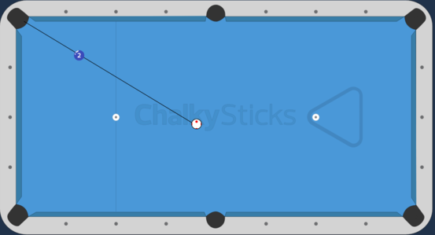
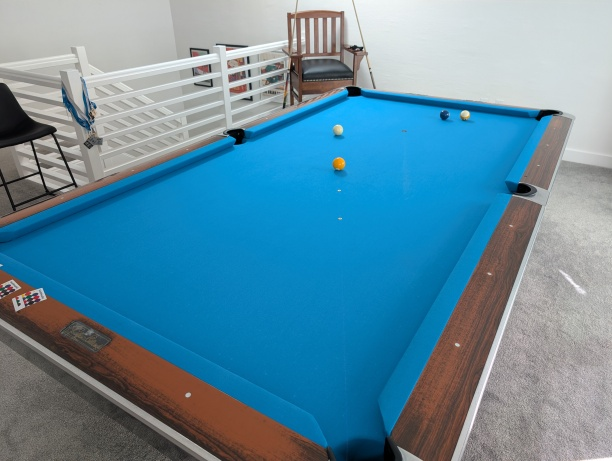
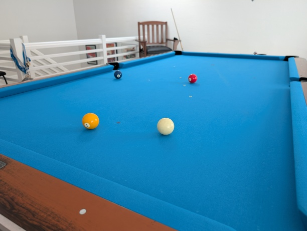
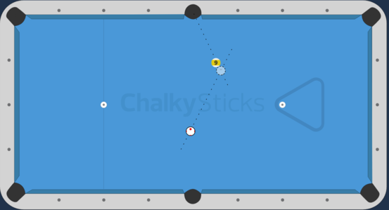
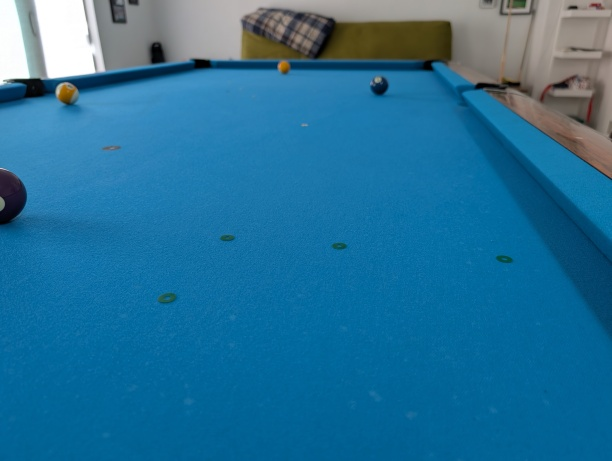
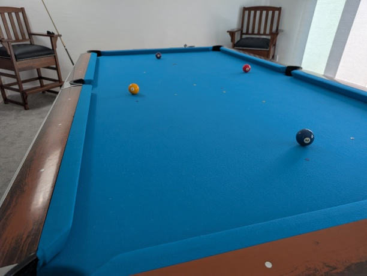

Wednesday this week I'm helping climbing friends become better pool players, so I'm getting some Big Thoughts™️about
pool written down ahead of time. Because the group is all climbers, I'm grading the drills on the [V-scale], but the
ideas and practice setup ought to build some pool intuition for anyone.

## Pool skills

<iframe width="560" height="315" src="https://www.youtube.com/embed/ZMEtKVZZcfU?si=AHK6LlZ4M3TATFn_" title="YouTube video player" frameborder="0" referrerpolicy="strict-origin-when-cross-origin" allowfullscreen></iframe>

There are two pool skills that are prior to all the others: shooting straight and aiming. I don't mean that all other
skills are derived from these two -- mental skills for competitive play obviously aren't derived from these two -- but
they're both definitely required if you want to be able to work on any other skills

These two skills are complementary. Typically, people present complementary skills in a positive light: shooting
straighter makes aiming better even more valuable and vice versa. In this case, I want to focus on the negative side.
If you don't know whether you're shooting straight or how to aim, pool feels essentially random. Without aiming well,
you can't make any specific predictions about where the cue ball and other balls will go, and without shooting
straight, you can't find out whether you aimed well or whether your predictions were any good. You strike the cue ball,
things happen, and you can't learn anything.

This positive feedback is different from climbing skills, which I think are substitutes. If you want to climb
things you can't climb today, you can *get stronger* (more finger power, more leg power, a stronger core) or *climb
better* (place your feet better, point your toes better in heel hooks, relax more in each position). You could also do
both and probably see more improvement,[^1] but in the short-term, each is valuable on its own, and you're likely to
see improvement with either one.

I don't think pool players are likely to see improvement with just one of aiming better or shooting straighter unless
they're already way better at one than the other, and most people don't start very good at either.

## Shooting straighter

Shooting straighter is easier to practice because it's easy to take aim out of a shot entirely. If you set up
two balls in a straight line to a pocket, aiming is done for you, since making the ball requires shooting
the center of the cue ball through the center of the object ball.[^2]

<figure>

<figcaption>The only thing to do here is shoot in a straight line. Diagram made with [ChalkySticks].</figcaption>
</figure>

Straight shots have some other nice properties for practice. They're easy to set up with a laser level and some cheap
stickers and they support progressions in different directions (more distance, stopping the cue ball, stringing a few
straight shots together).

Climbers are used to circuits, so I set up a two-problem circuit for straight shots. The first problem has yellow
stickers and requires hitting the same shot over different distances. I think it goes at V0 to V1.

The second requires stringing a few straight stop shots together on blue stickers, and I think it goes at V2 to V3.

A good stance, a smooth stroke, a stable bridge, a relaxed back hand, and stillness in the rest of your body all
contribute to straight shooting, but straight shooting is good however you achieve it. There's a lot of diversity
in how top professionals approach and execute each shot (compare
[Mohammad Soufi's](https://youtu.be/sHd4HQOUIzg?si=X05WbkK0rmDTVc5f&t=474) approach to
[Seo Seoa's](https://www.youtube.com/live/OGZG6kF-tRU?si=zBfUwcfgrRpNOt4P&t=311) for example), but in general, you
should try to achieve a smooth, relaxed, and straight delivery is what 

## Aiming better

Some shots aren't straight\[citation needed\], so it's also important to know how to aim cuts. Aiming
cuts stresses your ability to visualize an imaginary point on the table and then shoot straight through it. Many people
don't know how to pick a point to visualize.

The easiest way to practice finding the right aim point is by putting an actual ball at that point, turning the
[ghost ball][^3] into a real ball. If you have someone to remove the ghost ball before you shoot, then you're back
to just shooting in a straight line.

<figure>

<figcaption>Aiming through the center of the ghost ball makes the cut. Diagram made with [ChalkySticks].</figcaption>
</figure>

When many people try to aim a shot, they aim the center of the cue ball through the point on the object ball that they
think they need to hit. Aiming this way is wrong because both balls are spheres. Aiming this way will be more wrong the
more extreme the cut angle is. To make shots aiming this way, you must either mentally correct your aim afterward or
fail to shoot straight.

Another difficult challenge about cut shots is that where the cue ball ends up depends much more on your speed and
spin choices than with straight shots. I also set up a cuts circuit. It contains a green V3 with increasingly
difficult cuts and a heartbreaking finish

and a purple reversible V4 aka "the rhombus."[^4]

Aiming is harder to improve, because the feedback from misses is less obvious. It's possible to aim fine and
fail to shoot straight, but it's also easy to change the aim by accident after aiming correctly then to shoot straight
through the wrong aim. Repeatable series of cuts like these should provide better feedback than just playing games.

[ghost ball]: https://drdavepoolinfo.com/faq/aiming/ghost-ball/
[ChalkySticks]: https://pad.chalkysticks.com/
[V-scale]: https://en.wikipedia.org/wiki/Grade_(climbing)#V-grade
[^1]: I'm not your climbing coach, do what you want.
[^2]: As an aside, I think straight shots' simplicity is why more experienced pool players hate them. For more complicated
shots, there's a lot more room to blame a speck of dust on the table, rails playing short or long, humidity, or weird
action between the cue ball and the object ball. On a straight shot, none of that is in play -- everyone knows the line
you have to be able to shoot, and you either do it or you don't. If you  miss, it's _definitely your fault_.
That's pretty rough on the ego.
[^3]: tl;dr: the "ghost ball" is an imaginary ball contacting the object ball at a point where the line through the
center of both balls traces the path you want the real ball to follow.
[^4]: Climbing grades [are subjective](https://www.reddit.com/r/climbing/comments/r9r4mu/v2_in_my_gym_visualising_the_distributions_of/). Climbing grades
for pool drills will necessarily be even more subjective and a little non-sensical. If the purple V4 is V2 on your pool
table, good for you.
